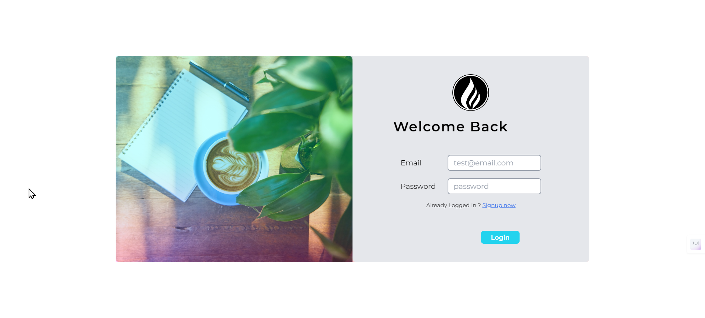
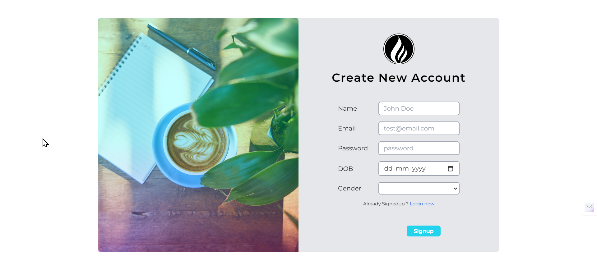
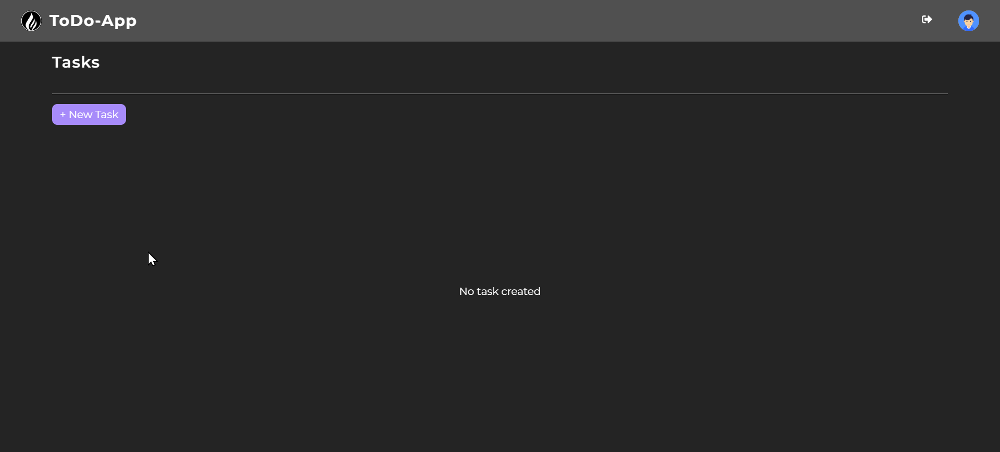
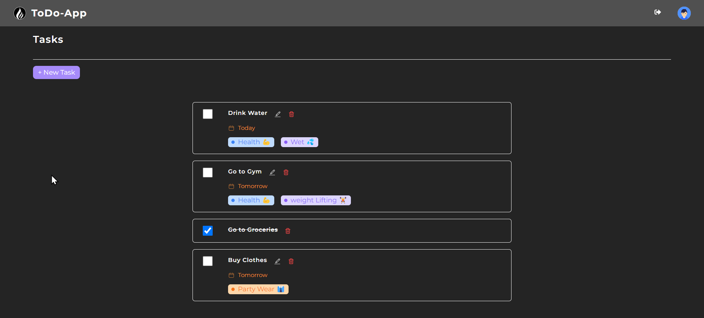

# ToDo  : Full Stack ToDo Web App 
## Frontend part 

### Preview







### Realease 
- Frontend : 
  - [Live](https://to-do-app-frontend-ecru.vercel.app/)
  - [Repo](https://github.com/DevDK12/ToDo-App_frontend)

- Backend : 
  - [Live](https://todo-app-backend-3p6y.onrender.com/)
  - [Repo](https://github.com/DevDK12/ToDo-App_backend)


### Install 
Please follow the instructions below to install the required packages.

Note : This Project uses Vite-react Plugin : [@vitejs/plugin-react-swc](https://github.com/vitejs/vite-plugin-react-swc) uses [SWC](https://swc.rs/) for Fast Refresh


1. Clone Repository 
```bash
git clone https://github.com/DevDK12/ToDo-App_frontend.git
```
```bash
cd ToDo-App_frontend
```


2. Install Package
```bash
npm i
```


3. Configure `.env` file
**Note :** Create `.env` file in root directory
Create Firebase and Stripe account to get their api keys
Replace `<>` with corresponding key
Do not use any `"` around key or id
```bash
VITE_SERVER=http://localhost:3000
```


4. Run project
```bash
npm run dev
```


